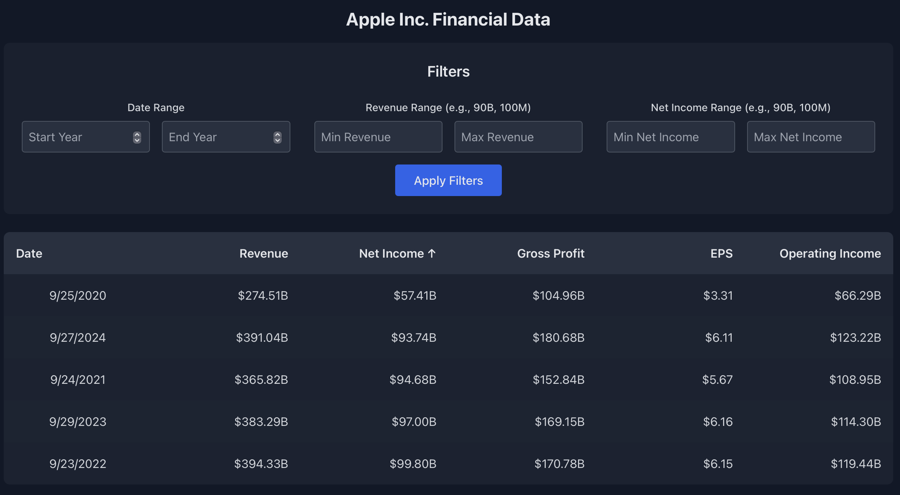
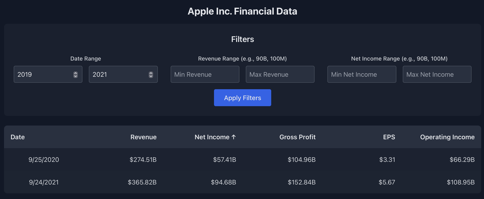
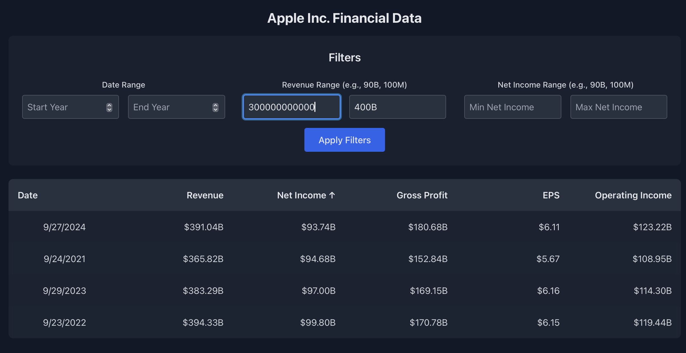
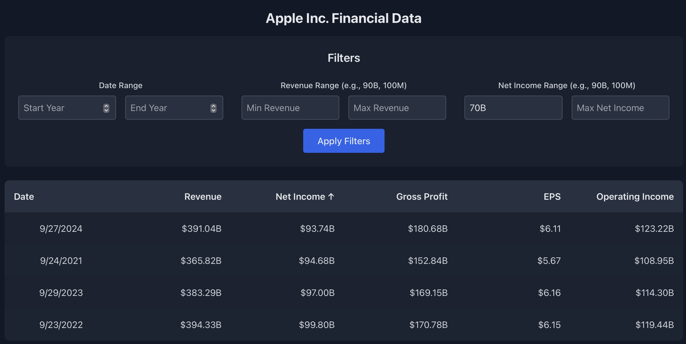
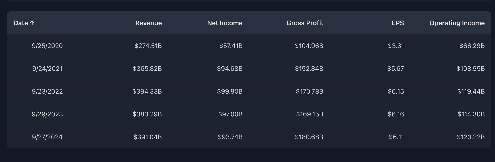
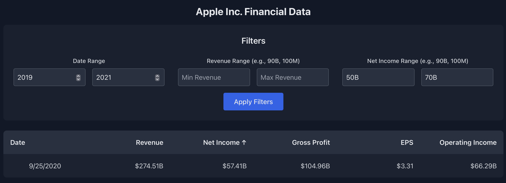

#Financial Data Visualization App

A React Web Application for vizualizing and analysing data from an api end point.
The app will fetch annual income statements for AAPL (Apple) and allow users to filter and analyze key metrics.

Obtained a free key from site.financialmodelingprep.com
Api End Point: https://financialmodelingprep.com/api/v3/income-statement/AAPL?period=annual&apikey=<api_key>

---

##Technology Used:

- **Frontend**: React, TailwindCSS
- **API**: [Financial Modeling Prep](https://financialmodelingprep.com)
- **Deployment**: GitHub

---

##Features:

1. **Data Fetching**:
   - Fetches financial data like revenue, net income, gross profit, etc from the API.
   - Displays the data in a table.

2. **Filtering**:
   - Filter results based on:
     - **Date Range**: Specify start and end years.
     - **Revenue Range**: Filter rows by revenue in a user-specified range.
     - **Net Income Range**: Filter rows by net income in a user-specified range.

3. **Sorting**:
   - Sort data by:
     - **Date** (ascending/descending).
     - **Revenue** (ascending/descending).
     - **Net Income** (ascending/descending).

4. **Responsive Design**:
   - Optimized for both desktop and mobile views.
   - Styled with **TailwindCSS**.

---

##App Design:

    

    

    

    

    

    

    

---

